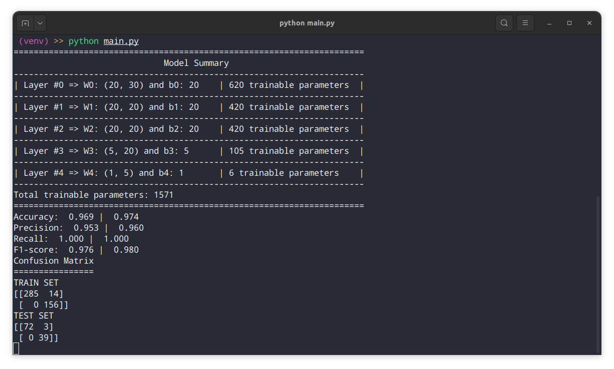
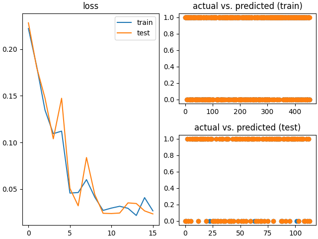

# Neural Network From Scratch In Python
We build and train a neural network architecture in `Python` without usage of deep learning frameworks.

Detailed steps of the backpropagation algorithm are shown in the animation below ([source](https://github.com/a-mhamdi/jlai/blob/main/Slides-Labs/Demystifying%20AI%20Sorcery%20(Part-1).pdf)).

**Simulation**

Simulation results for a classification problem are shown below. The used dataset is `breast_cancer` from the `sklearn` library.

The code is written in `Python` and can be found in the `src` folder. The `main.py` file contains the main code to run the simulation.